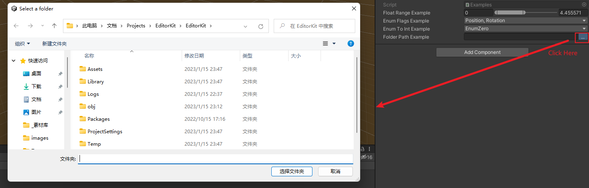
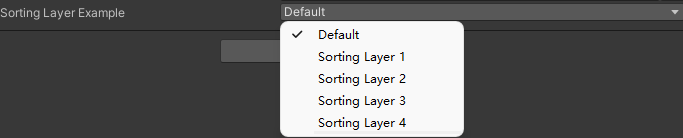

# README
## 简介：
收集一些在工作中写的Utils
## 目录：
[1.FloatRange](#FloatRange)  
[2.EnumFlags](#EnumFlags)  
[3.EnumToInt](#EnumToInt)  
[4.FolderPath](#FolderPath)  
[5.SortingLayer](#SortingLayer)  
[6.AssetHash](#AssetHash)  
## <span id="FloatRange">FloatRange</span>
很简单的一个结构体，写个属性方便编辑。
```csharp
[System.Serializable]
public struct FloatRange
{
    public float min, max;
}
```


## <span id="EnumFlags">EnumFlags</span>
通过给枚举加上[EnumFlags]，从而可以实现多选。（例如像unity里面的Layer）  
注意：需要复习一下二进制运算。

示例代码：
```csharp
public enum TargetProperty
{
    Position        = 1<<0,
    Rotation        = 1<<1,
    Scale           = 1<<2,
    ClearFlags      = 1<<3,
    CullingMask     = 1<<4,
    FieldOfView     = 1<<5,
    NearClipPlane   = 1<<6,
    FarClipPlane    = 1<<7,
    Depth           = 1<<8
}

[EnumFlags]
public TargetProperty EnumFlagsExample;
```


## <span id="EnumToInt">EnumToInt</span>
通过给Int字段，加上[EnumInt(typeof(enum))],从而实现在Inspector中用户选择枚举类型，但是以Int的方式储存数据。
  
示例代码：
```csharp
    [EnumToInt(typeof(EnumToIntExample))]
    public int enumToIntExample;
```


## <span id="FolderPath">FolderPath</span>
通过给string字段，加上[FolderPath],从而实现在Inspector点击该字段，则跳出文件夹选择窗口。选择后，将路径保存在string字符串中。  
示例代码：
```csharp
    [FolderPath]
    public string folderPathExample;
```
  


## <span id="SortingLayer">SortingLayer</span>
项目中经常需要序列化某个SortingLayer的值，手填Int操作十分麻烦，需要打开SortingLayer编辑面板，记住想要的值，再填。想要和ParticleSystem同样选SortingLayer的下拉框，Unity官方没有提供EditorGUI的接口，这里提供一个自己写的Attribute.  
示例代码:
```csharp
    [SortingLayer]
    public int SortingLayerExample;
```



## <span id="AssetHash">AssetHash</span>
可以在Library创建一个Cache，记录资源是否变化，用于不同模块对比资源是否变化。
