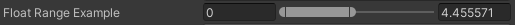
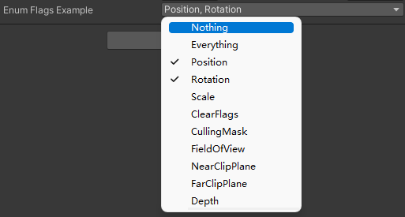

# AttributeCollection
## 简介：
收集一些在工作中写的CustomAttribute。
## FloatRange
很简单的一个结构体，写个属性方便编辑。
```csharp
[System.Serializable]
public struct FloatRange
{
    public float min, max;
}
```


## EnumFlags
通过给枚举加上[EnumFlags]，从而可以实现多选。（例如像unity里面的Layer）  
注意：需要复习一下二进制运算。

示例代码：
```csharp
public enum TargetProperty
{
    Position        = 1<<0,
    Rotation        = 1<<1,
    Scale           = 1<<2,
    ClearFlags      = 1<<3,
    CullingMask     = 1<<4,
    FieldOfView     = 1<<5,
    NearClipPlane   = 1<<6,
    FarClipPlane    = 1<<7,
    Depth           = 1<<8
}

[EnumFlags]
public TargetProperty selectedProperty;
```

